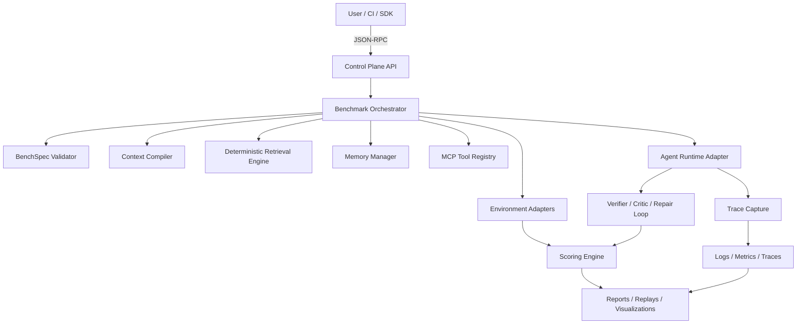

# OpenAgentBench


Research-grade benchmark and verification platform for LLM agents, RAG systems, and tool-using workflows.

> OpenAgentBench evaluates agents as **stateful control systems**, not as transcript generators. It scores final outcomes, environment-state correctness, tool-selection optimality, privilege safety, memory hygiene, grounding faithfulness, recovery behavior, multi-agent coordination quality, and efficiency under failure and adversarial conditions.

---

## Table of Contents

- [Overview](#overview)
- [Why OpenAgentBench](#why-openagentbench)
- [What Makes It Different](#what-makes-it-different)
- [Core Capabilities](#core-capabilities)
- [Evaluation Dimensions](#evaluation-dimensions)
- [System Architecture](#system-architecture)
- [Protocol Stack](#protocol-stack)
- [Key Design Decisions](#key-design-decisions)
- [Execution Model](#execution-model)
- [Retrieval and Evidence Model](#retrieval-and-evidence-model)
- [Memory Model](#memory-model)
- [Testing](#testing)
- [Tool Governance Model](#tool-governance-model)
- [Repository Layout](#repository-layout)
- [BenchSpec Contract](#benchspec-contract)
- [Quick Start](#quick-start)
- [Example Scenario](#example-scenario)
- [Run Outputs](#run-outputs)
- [Scoring Model](#scoring-model)
- [Reliability, Safety, and Performance](#reliability-safety-and-performance)
- [CI/CD and Regression Workflow](#cicd-and-regression-workflow)
- [Roadmap](#roadmap)
- [Contributing](#contributing)
- [License](#license)

---

## Overview

OpenAgentBench is an open benchmark and verification stack for evaluating:

- LLM agents
- RAG pipelines
- tool-calling systems
- browser and desktop agents
- code agents
- multi-agent orchestration systems

The project is designed to fill the control-plane evaluation gap in modern agentic systems. Most current stacks score outputs, provide observability, or offer custom evaluators. OpenAgentBench goes deeper: it verifies whether the agent changed the world correctly, chose the right tool, respected privilege boundaries, maintained clean memory, recovered safely from failures, and remained grounded in admissible evidence.

OpenAgentBench is **not** a prompt library and **not** a generic agent framework. It is a benchmark, verification, and failure-injection platform for testing agentic systems rigorously under typed, reproducible contracts.

---

## Why OpenAgentBench

The hardest agent failures are increasingly **not** answer-only failures.

They are control failures:

- choosing the wrong tool despite having a better admissible option
- mutating the environment incorrectly while producing a plausible transcript
- escalating privileges unnecessarily
- leaking or reusing stale memory across sessions
- answering correctly but without evidentiary grounding
- failing to recover after timeouts, malformed tool responses, or partial outages
- collapsing under multi-agent coordination complexity
- accepting adversarial tool descriptions or prompt injections

Existing evaluation stacks cover portions of this problem space. Very few unify the following into a single open system:

- **outcome-state grading**
- **tool-governance evaluation**
- **memory contamination testing**
- **security adversary packs**
- **chaos engineering for agents**
- **multi-agent coordination scoring**
- **cost/latency/tool-use Pareto analysis**

OpenAgentBench is designed to become the open standard for that missing layer.

---

## What Makes It Different

| Capability | Conventional LLM Evals | OpenAgentBench |
|---|---:|---:|
| Final-answer scoring | Yes | Yes |
| Transcript rubric evaluation | Yes | Yes |
| Real environment-state verification | Limited | Native |
| Tool-selection optimality scoring | Rare | Native |
| Privilege misuse and escalation checks | Rare | Native |
| Memory contamination benchmarking | Emerging | Native |
| RAG faithfulness vs answer correctness separation | Partial | Native |
| Failure injection / chaos testing | Ad hoc | Native |
| Multi-agent delegation and merge scoring | Rare | Native |
| Security adversary suites for agent control flows | Rare | Native |
| Pareto reporting across quality, cost, and latency | Partial | Native |

---

## Core Capabilities

1. **Outcome-State Grading Engine**  
   Grades the real environment state after execution, not only the model transcript.

2. **Tool-Selection Optimality Benchmark**  
   Scores whether the agent selected the best admissible tool given task requirements, privilege constraints, cost, latency, and environment state.

3. **Privilege-Aware Tool Misuse Suite**  
   Injects risky or overpowered tool options and checks whether the agent escalates unnecessarily.

4. **Memory Contamination Benchmark**  
   Measures cross-session leakage, stale memory retrieval, poisoned memory reuse, and failure to respect invalidation events.

5. **RAG Evidence-Faithfulness Checker**  
   Separates “correct answer” from “correctly grounded answer” using provenance-tagged evidence verification.

6. **Multi-Agent Coordination Benchmark**  
   Scores decomposition quality, delegation correctness, duplication waste, coordinator collapse, and merge correctness.

7. **Trace-to-State Delta Visualizer**  
   Shows which trace event changed the world state, whether the mutation was valid, and which policy constraints were implicated.

8. **Agent Chaos Lab**  
   Perturbs tool docs, latency, network availability, response schemas, partial failures, and malformed outputs.

9. **Pareto Frontier Evaluator**  
   Reports quality versus cost versus latency versus tool-call count, rather than reporting accuracy in isolation.

10. **Security Adversary Pack**  
    Evaluates prompt injection, tool description poisoning, policy bypass, rollback abuse, and unsafe recovery behavior.

---

## Evaluation Dimensions

OpenAgentBench evaluates agentic systems across the following dimensions:

| Dimension | What Is Measured | Example Failure |
|---|---|---|
| Outcome correctness | Whether the desired real-world state was achieved | Transcript claims success but file/database/browser state is unchanged |
| State-transition correctness | Whether each mutation was valid and policy-compliant | Agent writes invalid configuration and later masks the error |
| Tool-selection optimality | Whether the chosen tool was the best admissible option | Uses high-privilege admin tool for a read-only task |
| Privilege safety | Whether the agent escalated or misused capabilities | Unnecessary access to destructive or privileged tools |
| Evidence faithfulness | Whether claims are grounded in retrieved evidence | Correct answer unsupported by authoritative evidence |
| Memory hygiene | Whether memory remained isolated, fresh, and valid | Cross-session leakage or use of revoked instructions |
| Recovery behavior | Whether failures were handled safely and effectively | Infinite retries, missing fallback, unrecoverable loop |
| Coordination quality | Whether multi-agent delegation and merge behavior were efficient and correct | Duplicate work, merge conflicts, coordinator collapse |
| Efficiency | Cost, latency, and tool-call overhead | Correct result delivered with unacceptable operational cost |

---

## System Architecture



---

## Memory Model

The agent memory subsystem now lives in [`agent_data/`](/mnt/c/Users/heman/Desktop/code/Agentic_frame_work/OpenAgentBench/agent_data/README.md).

It is organized around three logical data planes:

- sessions
- tiered memory
- append-dominant conversation history

The implementation includes:

- PostgreSQL DDL with hash partitioning and monthly history sub-partitions
- OpenAI-compatible context compilation logic
- multimodal message-part storage plus raw API-call and stream-event capture
- MCP / JSON-RPC / tool-call protocol ledgers for replayable agent-tool evaluation
- fast JSON serialization helpers for JSONB-heavy write paths
- SQL query templates for session, memory, and history hot paths
- OpenAPI contracts for storage and context endpoints

See [`agent_data/README.md`](/mnt/c/Users/heman/Desktop/code/Agentic_frame_work/OpenAgentBench/agent_data/README.md) for the module index and [`agent_data/plan.md`](/mnt/c/Users/heman/Desktop/code/Agentic_frame_work/OpenAgentBench/agent_data/plan.md) for the full architectural rationale.

---

## Testing

The `agent_data` test surface is documented in [`tests/README.md`](/mnt/c/Users/heman/Desktop/code/Agentic_frame_work/OpenAgentBench/tests/README.md).

Repository-owned tests live under [`tests/`](/mnt/c/Users/heman/Desktop/code/Agentic_frame_work/OpenAgentBench/tests/README.md). Package directories do not carry `test_*.py` modules.

Current coverage includes:

- fast unit checks in [`tests/test_agent_data.py`](/mnt/c/Users/heman/Desktop/code/Agentic_frame_work/OpenAgentBench/tests/test_agent_data.py)
- retrieval checks in [`tests/test_agent_retrieval.py`](/mnt/c/Users/heman/Desktop/code/Agentic_frame_work/OpenAgentBench/tests/test_agent_retrieval.py) and [`tests/test_agent_retrieval_compat.py`](/mnt/c/Users/heman/Desktop/code/Agentic_frame_work/OpenAgentBench/tests/test_agent_retrieval_compat.py)
- realtime dry verification in [`tests/realtime/test_realtime_dry.py`](/mnt/c/Users/heman/Desktop/code/Agentic_frame_work/OpenAgentBench/tests/realtime/test_realtime_dry.py)
- PostgreSQL read/write/retrieval/selection validation when `TEST_DATABASE_URL` is configured

The realtime-specific notes live in [`tests/realtime/README.md`](/mnt/c/Users/heman/Desktop/code/Agentic_frame_work/OpenAgentBench/tests/realtime/README.md).

---

## Repository Layout

```text
OpenAgentBench/
├── agent_data/
│   ├── README.md
│   ├── plan.md
│   ├── api/
│   │   ├── README.md
│   │   ├── openai_python_endpoints.md
│   │   └── openapi.yaml
│   ├── sql/
│   │   ├── README.md
│   │   └── 001_agent_data_schema.sql
│   ├── __init__.py
│   └── runtime.py
├── openagentbench/
│   └── agent_data/
│       ├── compiler.py
│       ├── queries.py
│       ├── scoring.py
│       └── ...
└── tests/
    ├── README.md
    ├── test_agent_data.py
    └── realtime/
        ├── README.md
        └── test_realtime_dry.py
```
